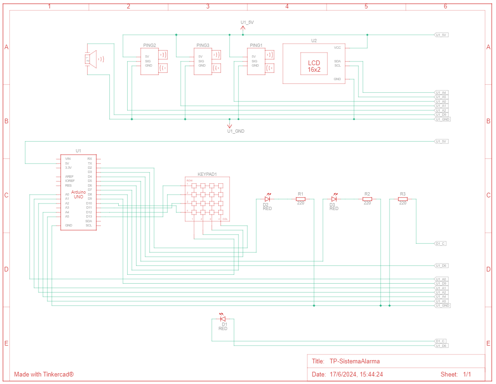

# TP-SistemaAlarma-Embedidos2024
Sistema de alarma para trabajo practico de cursada de la materia "Sistemas Emebebidos" de la UNLa

Proyecto realizado con Arduino Uno en Tinkercad. Adjunto imagen de Tinkercad y circuito.

